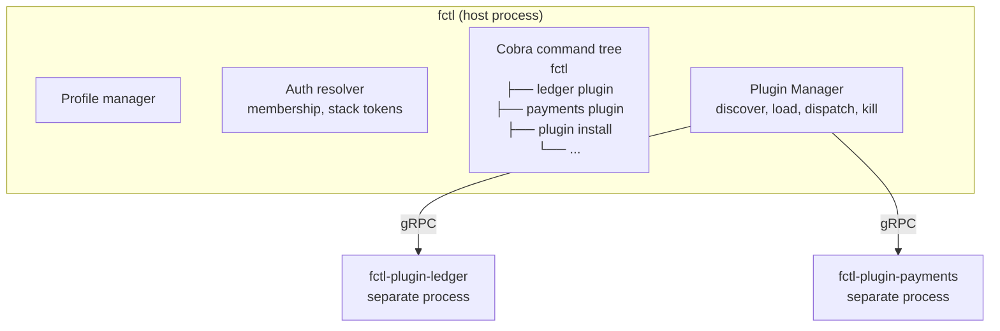
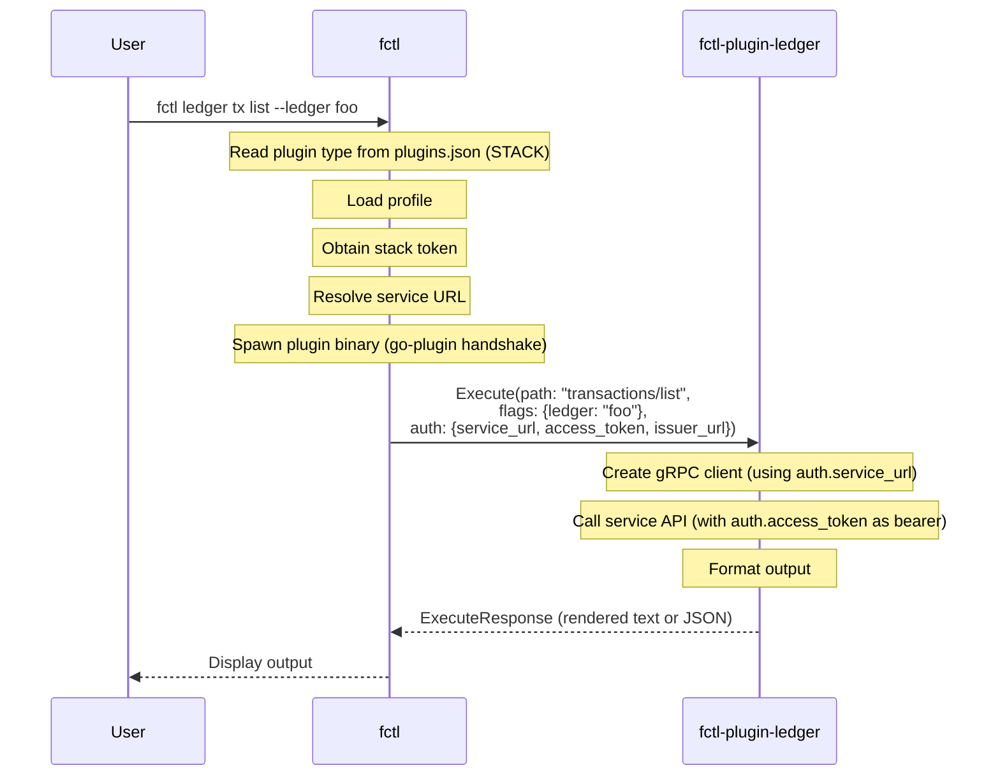
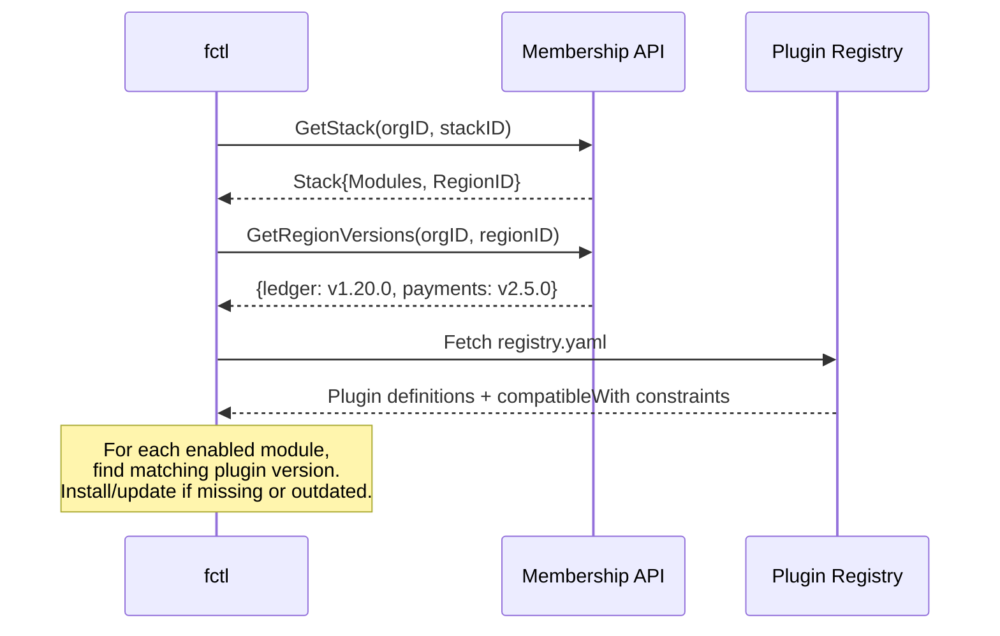
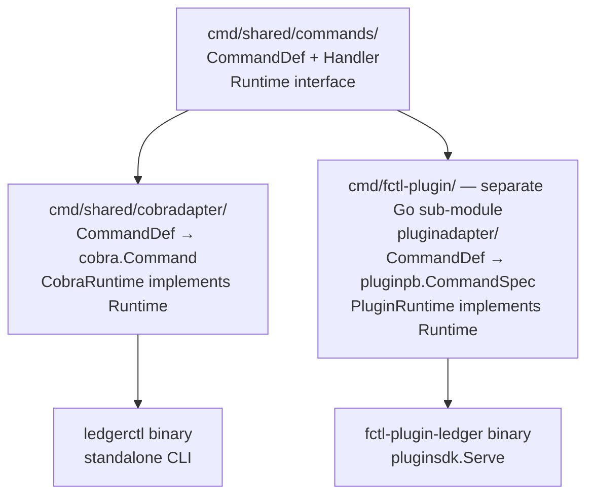

# fctl Plugin Architecture

## Overview

fctl uses a **plugin system** to let each Formance product (ledger, payments, etc.) provide its own CLI commands. Plugins are **separate binaries** that communicate with fctl over gRPC using HashiCorp's [go-plugin](https://github.com/hashicorp/go-plugin) framework.

This keeps product-specific logic out of fctl's core, allows independent release cycles, and lets each product team own their CLI experience.



## Plugin protocol

### gRPC service

Each plugin implements a single gRPC service with two RPCs:

```protobuf
service PluginService {
  rpc GetManifest(GetManifestRequest) returns (GetManifestResponse);
  rpc Execute(ExecuteRequest) returns (ExecuteResponse);
}
```

- **GetManifest**: returns the plugin's metadata and full command tree. Called once at install/update time, then cached.
- **Execute**: runs a specific command. Called each time the user invokes a plugin command.

### Handshake

fctl and plugins use a magic cookie for process-level validation:

```go
HandshakeConfig{
    ProtocolVersion:  1,
    MagicCookieKey:   "FCTL_PLUGIN",
    MagicCookieValue: "formance",
}
```

The plugin binary is spawned by fctl. Communication happens over gRPC via the plugin's stdin/stdout (managed by go-plugin).

### Plugin manifest

```protobuf
message PluginManifest {
    string name         = 1;  // e.g. "ledger"
    string version      = 2;  // e.g. "1.0.0"
    string description  = 3;
    CommandSpec root_command = 4;  // full command tree
}
```

The manifest declares the entire command hierarchy. fctl converts it into cobra commands dynamically.

### Command spec

```protobuf
message CommandSpec {
    string use                  = 1;   // "transactions"
    repeated string aliases     = 2;   // ["tx", "t"]
    string short                = 3;   // short help
    string long                 = 4;   // long help
    repeated FlagSpec flags     = 5;
    repeated FlagSpec persistent_flags = 6;
    repeated CommandSpec subcommands   = 7;
    bool runnable               = 8;   // has an Execute handler
    bool hidden                 = 9;
    string deprecated           = 10;
    string args_constraint      = 11;  // "exact:1", "none", "max:2", etc.
    bool confirm                = 12;  // require --confirm flag
    Stability stability         = 13;
}

enum Stability {
    STABILITY_STABLE       = 0;  // default — must never be removed
    STABILITY_EXPERIMENTAL = 1;  // can be removed at any time
}
```

Each command declares a **stability level**:

| Stability | Meaning |
|-----------|---------|
| `stable` (default) | Part of the public contract. Must never be removed once shipped. Breaking changes require a new major version. |
| `experimental` | May be removed or changed at any time without notice. fctl displays an `[experimental]` tag in help output. |

This applies recursively: if a parent command is `experimental`, all its subcommands are implicitly experimental. A `stable` subcommand under an `experimental` parent is a manifest error.

Note: `CommandSpec` has no `CommandType` field. The plugin type is defined at the **registry level**, not per-command (see [Plugin types](#plugin-types) below).

### Plugin types

The plugin type determines what authentication context fctl resolves before calling the plugin. It is defined **once per plugin in the registry**, not per-command in the manifest. This keeps the plugin protocol simple — a plugin doesn't need to know about fctl's auth model.

| Type | Auth resolved | Use case |
|------|--------------|----------|
| `stack` | Stack access token + service URL | Product API calls (most common) |
| `membership` | Membership token + org ID | Org-level management |
| `basic` | None | Commands that don't need auth |

The type is stored in the registry and persisted in `plugins.json` at install time. fctl reads it at load time and applies the same auth resolution to **all commands** of the plugin.

In practice, a product plugin is either a stack-level plugin (ledger, payments, ...) or not. There's no need for per-command granularity — if a command doesn't use the auth context (e.g., `version`), it simply ignores it.

### Execute request

```protobuf
message ExecuteRequest {
    string command_path             = 1;  // "transactions/list"
    repeated string args            = 2;  // positional args
    map<string, string> flags       = 3;  // resolved flag values
    AuthContext auth_context        = 4;
    string output_format            = 5;  // "plain" or "json"
}
```

fctl collects all flags as `map[string, string]`, resolves auth based on the plugin type (from `plugins.json`), and sends everything to the plugin.

### Auth context

```protobuf
message AuthContext {
    string issuer_url       = 1;   // OIDC issuer URL (for token refresh / discovery)
    string service_url      = 2;   // service endpoint (gRPC, HTTP, etc.)
    string access_token     = 3;   // bearer token for the service
    bool   insecure_tls     = 4;   // skip TLS verification
}
```

fctl handles all the OAuth/OIDC flows, token refresh, and profile management. The plugin receives only what it needs: the service address, a ready-to-use token, the OIDC issuer (in case the plugin needs to refresh or introspect), and a TLS flag.

### Execute response

```protobuf
message ExecuteResponse {
    oneof result {
        ExecuteSuccess success = 1;
        ExecuteError error     = 2;
    }
}

message ExecuteSuccess {
    string json_data      = 1;  // structured output (for --output json)
    string rendered_text  = 2;  // human-readable output (tables, etc.)
}

message ExecuteError {
    string message = 1;
    int32 code     = 2;
}
```

## Plugin lifecycle

### 1. Install

`fctl plugin install ledger` (or `update`):

1. Fetch registry, resolve version and plugin type
2. Download the platform-specific binary to `~/.config/formance/fctl/plugins/{name}/{version}/fctl-plugin-{name}`
3. Spawn the binary, call `GetManifest()`, then kill the process
4. Cache the manifest and plugin type in `plugins.json`:

```json
{
  "plugins": [
    {
      "name": "ledger",
      "version": "1.0.0",
      "type": "stack",
      "path": "",
      "manifest": { ... }
    }
  ]
}
```

The manifest is only fetched at install/update time — not on every fctl startup.

If `path` is empty, fctl looks for the binary at:
`~/.config/formance/fctl/plugins/{name}/{version}/fctl-plugin-{name}`

### 2. Startup (no plugin process spawned)

On every fctl launch:

1. Read `plugins.json`
2. For each plugin, rebuild cobra commands from the **cached manifest**
3. If a built-in fctl command has the same name, the plugin **overrides** it

No plugin binary is spawned at this stage. Help, autocompletion, and command discovery work without any plugin process running.

### 3. Command execution

When the user runs `fctl ledger transactions list --ledger foo`:



### 4. Shutdown

On fctl exit, `PluginManager.Shutdown()` kills all plugin processes.

## Plugin management CLI

fctl provides built-in commands for managing plugins:

```bash
# Install a plugin from the registry
fctl plugin install ledger
fctl plugin install ledger --version 1.2.0

# List installed plugins
fctl plugin list

# Update plugins
fctl plugin update ledger      # update one
fctl plugin update --all       # update all

# Remove a plugin
fctl plugin remove ledger
```

### Local plugin development

For development and testing, fctl supports installing a plugin from a local directory:

```bash
fctl plugin install --path /path/to/fctl-plugin-ledger
```

When `--path` points to a Go source directory (detected by the presence of a `go.mod` file), fctl will:

1. Run `go build -o <plugin-dir>/fctl-plugin-<name> .` in the given directory
2. Copy the resulting binary to the plugin directory
3. Spawn it, call `GetManifest()`, cache the manifest, then kill the process

This avoids the need to manually build and copy binaries during development. The plugin type must be specified explicitly since there is no registry lookup:

```bash
fctl plugin install --path ./cmd/fctl-plugin --type stack
```

To rebuild after code changes, simply re-run the same command. The cached manifest will be refreshed.

### Plugin registry

Plugins are distributed via a central registry hosted on GitHub as a YAML file:
`https://raw.githubusercontent.com/formancehq/fctl-plugin-registry/main/registry.yaml`

The registry contains per-plugin metadata including the **plugin type** and platform-specific binary URLs:

```yaml
plugins:
  ledger:
    type: stack
    versions:
      1.0.0:
        minCoreVersion: "0.1.0"
        binaries:
          linux/amd64:
            url: https://github.com/.../ledger-linux-amd64
            sha256: a1b2c3d4e5f6...
          linux/arm64:
            url: https://github.com/.../ledger-linux-arm64
            sha256: f6e5d4c3b2a1...
          darwin/amd64:
            url: https://github.com/.../ledger-darwin-amd64
            sha256: 1a2b3c4d5e6f...
          darwin/arm64:
            url: https://github.com/.../ledger-darwin-arm64
            sha256: 6f5e4d3c2b1a...

  payments:
    type: stack
    versions:
      1.0.0:
        minCoreVersion: "0.1.0"
        binaries:
          linux/amd64:
            url: https://github.com/.../payments-linux-amd64
            sha256: abcdef123456...
          darwin/arm64:
            url: https://github.com/.../payments-darwin-arm64
            sha256: 654321fedcba...
```

After downloading a binary, fctl computes its SHA-256 hash and compares it against the registry checksum. If they don't match, the install is aborted and the binary is deleted. This protects against corrupted downloads and tampered binaries.

The `type` field (`stack`, `membership`, or `basic`) tells fctl what auth context to resolve for this plugin. It is persisted in `plugins.json` at install time so fctl doesn't need to fetch the registry on every startup.

### Registry workflow

Each product team sets up a CI pipeline that, on every release:

1. Builds the plugin binary for all target platforms
2. Uploads the binaries to GitHub Releases
3. Opens a PR on the `fctl-plugin-registry` repo to add the new version entry in `registry.yaml`

Old versions are removed manually from the registry when they are no longer supported. The registry only lists actively supported versions.

## Auto-discovery

When working with Formance Cloud, fctl can automatically discover and install the plugins needed for a stack.

### Available data from membership

The membership API provides:

- **`Stack.Modules`**: list of enabled modules on the stack (e.g., `ledger`, `payments`), with state (ENABLED/DISABLED) but no version.
- **`GetRegionVersions(orgID, regionID)`**: returns a `map[string]string` mapping component names to their versions (e.g., `{"ledger": "v1.20.0", "payments": "v2.5.0"}`).

### Auto-discovery flow

When a user selects a stack (via `fctl stack use` or `--stack`), fctl can automatically ensure the right plugins are installed:



Steps:

1. Fetch the stack from membership — get the list of enabled `Modules` and the `RegionID`
2. Call `GetRegionVersions(orgID, regionID)` — get the component → version map
3. For each enabled module, look up the registry to find a plugin version compatible with that component version (using `minCoreVersion` or an explicit compatibility map)
4. If the plugin is missing or outdated, install/update it automatically

### Registry compatibility

The registry needs a way to express which plugin version is compatible with which component version. The `minCoreVersion` field already serves this purpose — it indicates the minimum fctl version required. We add a `compatibleWith` field to express component version compatibility:

```yaml
plugins:
  ledger:
    type: stack
    versions:
      2.0.0:
        minCoreVersion: "0.1.0"
        compatibleWith: ">=1.18.0"   # compatible with ledger >= v1.18.0
        binaries:
          linux/amd64:
            url: https://github.com/.../ledger-linux-amd64
            sha256: a1b2c3d4e5f6...
          darwin/arm64:
            url: https://github.com/.../ledger-darwin-arm64
            sha256: 6f5e4d3c2b1a...
```

fctl matches the component version from the region against the `compatibleWith` constraint to select the right plugin version.

### Opt-in behavior

Auto-discovery is opt-in and only triggers in cloud mode (when a stack is selected). It can be disabled with `--no-auto-plugins` or a profile setting. In non-cloud mode (direct gRPC, standalone CLIs), plugins are managed manually.

## Plugin SDK

Product teams implement a plugin using the `pluginsdk` Go package:

```go
package pluginsdk

type FctlPlugin interface {
    GetManifest(ctx context.Context) (*pluginpb.PluginManifest, error)
    Execute(ctx context.Context, req *pluginpb.ExecuteRequest) (*pluginpb.ExecuteResponse, error)
}

func Serve(impl FctlPlugin)
```

### Minimal plugin example

```go
package main

import (
    "context"
    "github.com/formancehq/fctl/pkg/pluginsdk"
    "github.com/formancehq/fctl/pkg/pluginsdk/pluginpb"
)

type MyPlugin struct{}

func (p *MyPlugin) GetManifest(_ context.Context) (*pluginpb.PluginManifest, error) {
    return &pluginpb.PluginManifest{
        Name:    "my-product",
        Version: "1.0.0",
        RootCommand: &pluginpb.CommandSpec{
            Use:   "my-product",
            Short: "My product commands",
            Subcommands: []*pluginpb.CommandSpec{
                {
                    Use:      "list",
                    Short:    "List resources",
                    Runnable: true,
                },
            },
        },
    }, nil
}

func (p *MyPlugin) Execute(ctx context.Context, req *pluginpb.ExecuteRequest) (*pluginpb.ExecuteResponse, error) {
    // req.CommandPath = "list"
    // req.AuthContext.ServiceUrl = "grpc.stack-xxx.formance.cloud:443"
    // req.AuthContext.AccessToken = "eyJ..."

    // Call your product's gRPC API using the auth context...

    return &pluginpb.ExecuteResponse{
        Result: &pluginpb.ExecuteResponse_Success{
            Success: &pluginpb.ExecuteSuccess{
                RenderedText: "Resource 1\nResource 2\n",
            },
        },
    }, nil
}

func main() {
    pluginsdk.Serve(&MyPlugin{})
}
```

## Shared command pattern (ledger example)

For products that also have a standalone CLI (e.g., `ledgerctl`), commands can be defined once and built for both targets using an adapter pattern:



The `Runtime` interface abstracts flag access, gRPC client creation, output, and auth:

```go
type Runtime interface {
    Flag(name string) string
    BoolFlag(name string) bool
    Args() []string
    Writer() io.Writer
    IsJSON() bool
    Client() (servicepb.Client, *grpc.ClientConn, error)
    Context() (context.Context, context.CancelFunc)
    SignRequests(requests []*servicepb.Request) error
}
```

| | CobraRuntime (standalone CLI) | PluginRuntime (fctl plugin) |
|---|---|---|
| `Writer()` | `os.Stdout` | `bytes.Buffer` (returned in response) |
| `Client()` | From `--server` flag + profiles | From `AuthContext.StackUrl` |
| `Context()` | From `--auth-token` flag | From `AuthContext.AccessToken` |
| `SignRequests()` | Ed25519 signing from `--signing-key` | No-op |
| Interactive features | Spinners, prompts (in CLI-only commands) | Non-interactive, flags required |

The **sub-module** pattern (`cmd/fctl-plugin/go.mod`) keeps the pluginsdk dependency isolated — the main module has no knowledge of fctl.

## API versioning simplification

### The problem today

In the current monolithic fctl, every service API version must be handled inside a single binary. This leads to significant complexity:

- **Multi-version SDK dependency**: fctl imports a single SDK (`formance-sdk-go/v3`) that exposes versioned sub-clients: `stackClient.Payments.V1`, `stackClient.Payments.V3`, `stackClient.Ledger.V1`, `stackClient.Ledger.V2`, etc.
- **Runtime version negotiation**: payments commands call the server's `getServerInfo` endpoint at runtime to detect the API version, then branch accordingly. This logic is duplicated across ~28 commands.
- **Per-command branching**: each command contains `switch` or `if` blocks to call the right versioned method and handle version-specific request/response types (e.g., `V3CreateBankAccountRequest` vs `BankAccountRequest`).
- **Growing combinatorial complexity**: every new API version adds another branch to every affected command, and every command must handle all supported versions.

```
fctl ledger transactions list
    → detect server version
    → if v2: call Ledger.V2.ListTransactions()
    → if v1: call Ledger.V1.ListTransactions()
    → render with version-specific response type
```

This version negotiation logic is fctl's biggest source of accidental complexity.

### How plugins eliminate it

With the plugin architecture, **each plugin binary targets exactly one API version**. The version mapping moves from runtime code to the registry:

```
fctl-plugin-ledger v2.0.0  →  built against Ledger API v2
fctl-plugin-ledger v3.0.0  →  built against Ledger API v3
fctl-plugin-payments v1.0.0  →  built against Payments API v1
fctl-plugin-payments v2.0.0  →  built against Payments API v3
```

The plugin binary imports only the client library it needs — no multi-version SDK, no runtime detection, no branching. A plugin command looks like:

```go
func (p *Plugin) Execute(ctx context.Context, req *pluginpb.ExecuteRequest) (*pluginpb.ExecuteResponse, error) {
    // One client, one version — no negotiation
    client := ledgerclient.New(req.AuthContext.ServiceUrl, req.AuthContext.AccessToken)
    txs, err := client.ListTransactions(ctx, ledger, cursor)
    // ...
}
```

### Version selection via the registry

The `compatibleWith` field in the registry replaces all runtime version detection:

```yaml
plugins:
  ledger:
    type: stack
    versions:
      2.0.0:
        compatibleWith: ">=1.18.0 <2.0.0"  # for Ledger API v1.x
        binaries: { ... }
      3.0.0:
        compatibleWith: ">=2.0.0"           # for Ledger API v2.x
        binaries: { ... }

  payments:
    type: stack
    versions:
      1.0.0:
        compatibleWith: ">=1.0.0 <3.0.0"   # for Payments API v1/v2
        binaries: { ... }
      2.0.0:
        compatibleWith: ">=3.0.0"           # for Payments API v3
        binaries: { ... }
```

With [auto-discovery](#auto-discovery), fctl matches the actual service version running on the stack against the registry constraints and installs the right plugin version automatically. The user never needs to think about API versions.

### What this removes from the codebase

| Before (monolithic fctl) | After (plugins) |
|---|---|
| Single SDK with all API versions | Each plugin imports only its target client |
| `GetPaymentsVersion()` runtime detection | Registry `compatibleWith` at install time |
| Per-command version branching (`if V3 ... else V1`) | One code path per plugin binary |
| Version-specific request/response types in same command | Plugin uses one set of types |
| ~28 payments commands with version switches | Clean single-version commands |
| Version coupling between unrelated services | Each plugin evolves independently |

### Service APIs drop version prefixes

Since the plugin is built against a specific API version, the service APIs themselves no longer need to expose version prefixes in their paths or gRPC package names. Today, services expose versioned endpoints:

```
/api/ledger/v2/transactions
/api/payments/v3/bank-accounts
```

With plugins, the service can expose a single unversioned API:

```
/api/ledger/transactions
/api/payments/bank-accounts
```

Breaking changes are handled by releasing a new major version of the service, which triggers a new plugin version in the registry. The old plugin version continues to work with old service versions. There is no need to maintain multiple API versions within the same service binary — the version boundary moves to the plugin/service pair.

This aligns with the principle that **version compatibility is a deployment concern (registry + auto-discovery), not a code concern (runtime negotiation)**.

## Design principles

1. **Process isolation**: each plugin runs as a separate process. A crash in a plugin doesn't take down fctl.

2. **Manifest-driven commands**: plugins declare their CLI tree via a manifest. fctl caches it at install time and rebuilds cobra commands from the cache at startup — no plugin process is spawned until a command is actually executed.

3. **Auth delegation**: fctl handles all OAuth/OIDC flows, token refresh, profile management. Plugins receive ready-to-use credentials via `AuthContext`.

4. **Registry-level type**: the plugin type (`stack`, `membership`, `basic`) is defined once in the registry, not per-command. fctl resolves auth accordingly.

5. **Override built-in commands**: plugins can replace built-in fctl commands. This allows gradual migration from built-in to plugin-based commands.

6. **Registry distribution**: plugins are versioned and distributed via a central registry with per-platform binaries.

7. **Dual-target support**: products with a standalone CLI can define commands once and build for both targets using the adapter pattern + Runtime interface.

8. **No API version prefixes**: each plugin targets exactly one API version. Version negotiation moves from runtime code to the registry's `compatibleWith` constraints. Services can drop version prefixes from their API paths — breaking changes are handled by new plugin versions, not by branching logic in fctl.

## File map

| File | Purpose |
|------|---------|
| `pkg/pluginsdk/sdk.go` | Plugin SDK (FctlPlugin interface + Serve) |
| `pkg/pluginsdk/pluginpb/` | Generated protobuf types |
| `proto/fctl/plugin/v1/plugin.proto` | Protocol definition |
| `pkg/plugin/manager.go` | Plugin discovery, loading, install, lifecycle |
| `pkg/plugin/loader.go` | go-plugin client setup + gRPC connection |
| `pkg/plugin/cobra.go` | Manifest → cobra conversion + auth dispatch |
| `pkg/plugin/config.go` | plugins.json read/write |
| `pkg/plugin/registry.go` | Remote registry client |
| `cmd/plugin/` | `fctl plugin install/list/update/remove` commands |
| `cmd/root.go` | Plugin loading at startup (lines 118-131) |
